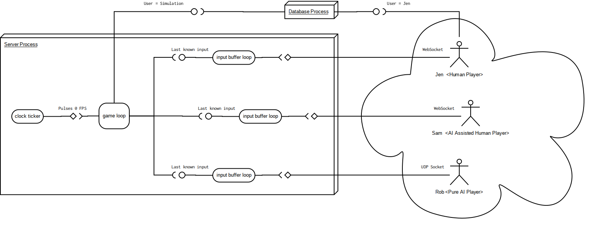

# Process architecture of a running game using engine

# Work journal

A journal to store work log of
[entries](log/entry/)
and
[ideas](log/idea/).
Reading the latest entry will give
some context to what's currently being
worked on, what's working, what's not working.
